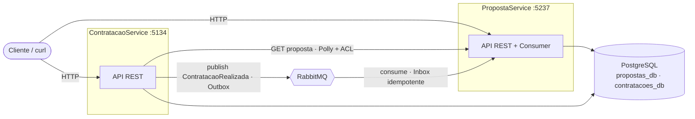
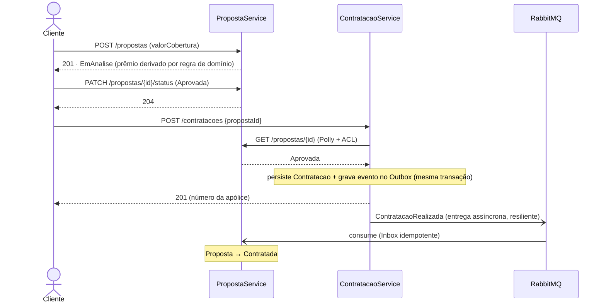

# Teste Técnico INDT — Arquitetura Hexagonal

Sistema de **propostas e contratações de seguro** composto por dois microserviços independentes,
em **Arquitetura Hexagonal (Ports & Adapters)** e **DDD**, com isolamento físico de dados por
serviço e comunicação **síncrona (HTTP REST)** + **assíncrona (RabbitMQ)** com entrega confiável
(Transactional Outbox/Inbox).

- **PropostaService** — criação, listagem e mudança de status de propostas.
- **ContratacaoService** — efetivação de contratações a partir de propostas aprovadas.

---

## Stack

- **.NET 10 / C#** — dois microserviços, 4 projetos cada (Domain · Application · Infrastructure · API).
- **PostgreSQL 17** — um servidor, dois bancos lógicos com usuários distintos por serviço.
- **RabbitMQ + MassTransit** — mensageria assíncrona com **Outbox** (publisher) e **Inbox** (consumer idempotente).
- **EF Core 10** — persistência e migrations (aplicadas no startup).
- **Polly** (`Microsoft.Extensions.Http.Resilience`) — resiliência na comunicação HTTP entre serviços.
- **Serilog + correlation id** — logs estruturados correlacionados atravessando os dois serviços.
- **Rate limiting nativo** — proteção dos endpoints de escrita (`429` em ProblemDetails).
- **xUnit + Testcontainers** — testes unitários e de integração contra Postgres real.
- **Docker Compose** — orquestração do ambiente completo.

> **Observabilidade — escopo:** optou-se por **Serilog + correlation id** (logs estruturados que
> atravessam HTTP e fila). OpenTelemetry/tracing distribuído ficou **conscientemente fora** (YAGNI):
> em produção seria habilitado junto à malha de observabilidade. Ver [decisões](#decisões-de-arquitetura-adrs).

---

## Arquitetura

Regra de dependência sempre apontando para o domínio; mensageria e banco são *driven adapters*,
controllers e o consumer são *driving adapters*.

```
API / Consumer (Driving Adapters)  →  Application (Use Cases + Ports)  →  Domain
Infrastructure (Driven Adapters)  ──implementa as Ports──↑
```



O contrato de integração (`ContratacaoRealizada`) vive num projeto compartilhado e estável
(`Contracts`), versionável (`Contracts.IntegrationEvents.V1`) — nunca se serializa entidade de domínio na fila.

### Fluxo crítico ponta a ponta



---

## Como executar

**Pré-requisitos:** Docker + Docker Compose.

```bash
cp .env.example .env          # credenciais de desenvolvimento (placeholders)
docker-compose up --build     # sobe Postgres, RabbitMQ, Adminer e os 2 serviços
```

As migrations são aplicadas automaticamente no startup de cada serviço.

| Serviço | URL | Swagger |
|---|---|---|
| PropostaService | http://localhost:5237 | http://localhost:5237/swagger |
| ContratacaoService | http://localhost:5134 | http://localhost:5134/swagger |
| RabbitMQ (Management UI) | http://localhost:15672 | usuário/senha do `.env` (`guest`/`guest`) |
| Adminer (UI do Postgres) | http://localhost:8080 | servidor `postgres` |

Health checks: `/health/live` (liveness) e `/health/ready` (readiness — checa o banco).

### Exemplos de chamada

```bash
# 1) Criar proposta (o prêmio é derivado da cobertura por regra de domínio; nunca é input do cliente)
curl -s -X POST http://localhost:5237/api/v1/propostas \
  -H 'Content-Type: application/json' \
  -d '{"clienteNome":"Maria","clienteDocumento":"529.982.247-25","clienteEmail":"maria@exemplo.com","valorCobertura":100000}'
# → 201 { "id": "...", "status": "EmAnalise", "valorPremio": 5000.00, ... }

# 2) Aprovar a proposta
curl -s -X PATCH http://localhost:5237/api/v1/propostas/{id}/status \
  -H 'Content-Type: application/json' -d '{"status":"Aprovada"}'
# → 204

# 3) Contratar (consulta síncrona à proposta + publica evento via Outbox)
curl -s -X POST http://localhost:5134/api/v1/contratacoes \
  -H 'Content-Type: application/json' -d '{"propostaId":"{id}"}'
# → 201 { "id": "...", "numeroApolice": "APO-2026-...", "valorPremioPago": 5000.00 }

# 4) A proposta vira "Contratada" de forma assíncrona (consumer idempotente)
curl -s http://localhost:5237/api/v1/propostas/{id}     # → status: "Contratada"
```

Correlation id: envie `X-Correlation-ID: <seu-id>` em qualquer requisição — ele é ecoado no
response e atravessa os dois serviços nos logs (inclusive pela fila). Se omitido, é gerado.

### Endpoints

| Método | Rota | Descrição |
|---|---|---|
| `POST` | `/api/v1/propostas` | Cria proposta (`EmAnalise`). *Escrita: rate-limited.* |
| `GET` | `/api/v1/propostas/{id}` | Obtém uma proposta. |
| `GET` | `/api/v1/propostas?status=&documento=&page=&pageSize=` | Lista paginada com filtros. |
| `PATCH` | `/api/v1/propostas/{id}/status` | `Aprovada` ou `Rejeitada`. *Escrita: rate-limited.* |
| `POST` | `/api/v1/contratacoes` | Contrata uma proposta aprovada. *Escrita: rate-limited.* |
| `GET` | `/api/v1/contratacoes/{id}` | Obtém uma contratação. |

`Contratada` só ocorre via consumo de evento — nunca pela API pública.

---

## Testes

```bash
dotnet test
```

> **Requer Docker:** os testes de integração usam **Testcontainers** (sobem um PostgreSQL real).

- **Unitários** — domínio (VOs, agregados, máquina de estados, cálculo de prêmio) e handlers de
  Application (com gateway/portas mockados).
- **Integração (Testcontainers)** — persistência/round-trip dos VOs, **índices únicos**
  (`PropostaId`, `Numero`) e **idempotência** (reprocessar o mesmo evento não duplica efeito).

---

## Resiliência e confiabilidade

- **Polly** no gateway HTTP (timeout, retry, circuit breaker) + **ACL** que traduz o contrato externo
  da proposta para o modelo interno, distinguindo `404` (inexistente) de `503` (indisponível).
- **Transactional Outbox** — o evento é gravado **na mesma transação** da contratação; a entrega ao
  broker é assíncrona e sobrevive a indisponibilidade do RabbitMQ.
- **Inbox idempotente** — reentrega do mesmo evento não duplica efeito (dedup por `MessageId`),
  reforçado pela idempotência do próprio agregado.
- **Invariante anti-duplicação em duas camadas** — verificação na Application (fast-fail) **e**
  índice único de `PropostaId` no banco (fonte de verdade).
- **Rate limiting** na borda (par *inbound* do Polly *outbound*) — `429 Too Many Requests` em ProblemDetails.

---

## Decisões de Arquitetura (ADRs)

1. **Hexagonal com 4 projetos por serviço** — a separação física força a regra de dependência.
2. **PostgreSQL com 2 bancos + usuários separados** — isolamento de dados sem o custo de 2 instâncias.
3. **Síncrono para verificação, assíncrono para reflexo de estado** — trade-off consistência × acoplamento.
4. **Outbox + Inbox** — entrega confiável fim a fim; justificado mesmo sendo bônus.
5. **Result pattern para regra de negócio; exceção só para invariante de domínio** — controle de fluxo limpo.
6. **Domínio puro** — o EF materializa o agregado pelo construtor privado + value converters; sem ctor de ORM.
7. **Postura de segurança** — ver **[ADR 0001](./adr/0001-postura-de-seguranca.md)**: rate limiting na
   borda; isolamento de dados; segredos via variáveis de ambiente; ProblemDetails que não vaza internos.

**YAGNI conscientes (fora do escopo, por quê):**

- **Autenticação/autorização, vault de segredos, rate limiting centralizado** → responsabilidade de um
  **API Gateway/ingress** em produção, não de cada serviço (ver ADR 0001).
- **OpenTelemetry/tracing distribuído** → Serilog + correlation id já cobrem a correlação fim a fim do escopo.
- **CQRS com read models separados, event sourcing** → fora do escopo "simples".

Racional detalhado e o roteiro de implementação (17 commits) no
[plano de implementação](./plano%20de%20implementação.md).
