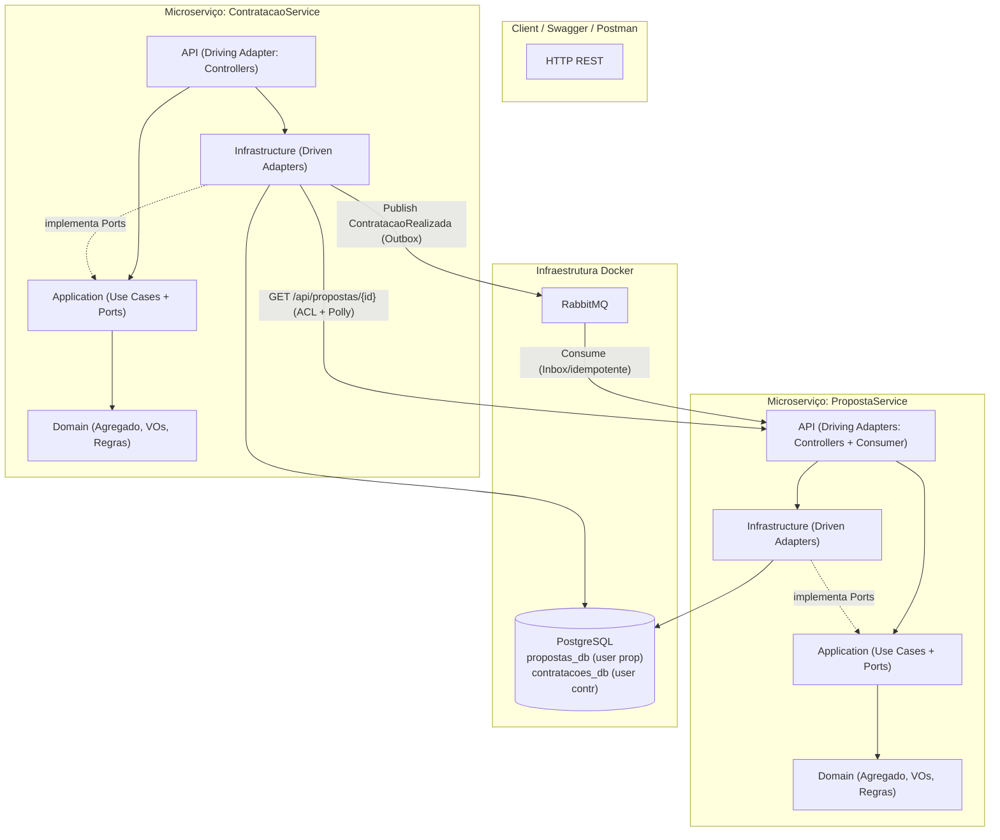

# Planejamento de Implementação — Teste Técnico INDT (Arquitetura Hexagonal)

Design técnico e roteiro de execução para o teste de nível **Sênior** da INDT: **Arquitetura Hexagonal (Ports & Adapters)**, **DDD**, isolamento de dados por microserviço, e comunicação síncrona (HTTP REST) + assíncrona (RabbitMQ via MassTransit) sobre **PostgreSQL**.

> **Filosofia deste plano:** demonstrar *julgamento de design*, não acúmulo de ferramentas. Cada peça de infraestrutura tem seu trade-off documentado, e decisões conscientes de **não** fazer algo (YAGNI) são tão importantes quanto o que é construído.

---

## Sumário

1. [Visão Geral da Arquitetura](#1-visão-geral-da-arquitetura)
2. [Modelagem de Domínio (DDD)](#2-modelagem-de-domínio-ddd)
3. [Consistência, Concorrência e Resiliência](#3-consistência-concorrência-e-resiliência)
4. [Banco de Dados e Índices](#4-banco-de-dados-e-índices)
5. [Mensageria (RabbitMQ + MassTransit)](#5-mensageria-rabbitmq--masstransit)
6. [Contrato da API REST](#6-contrato-da-api-rest)
7. [Observabilidade e Operação](#7-observabilidade-e-operação)
8. [Estratégia de Testes](#8-estratégia-de-testes)
9. [Decisões de Arquitetura (ADRs resumidas)](#9-decisões-de-arquitetura-adrs-resumidas)
10. [Roteiro de Execução por Commits](#10-roteiro-de-execução-por-commits)
11. [Checklist de Verificação Final](#11-checklist-de-verificação-final)

---

## 1. Visão Geral da Arquitetura

Dois microserviços independentes, com isolamento físico de dados e domínios, no mesmo ecossistema Docker.



### Regra de dependência (núcleo da Arquitetura Hexagonal)

As setas de dependência **sempre apontam para dentro**. O domínio não conhece ninguém; a Application define **Ports** (interfaces); a Infrastructure e a API são **Adapters** que dependem da Application — nunca o contrário.

| Camada | Responsabilidade | Pode depender de | Proibido |
|---|---|---|---|
| **Domain** | Entidades, agregados, Value Objects, eventos de domínio, regras e invariantes puras | Nada (só BCL) | EF Core, MassTransit, ASP.NET |
| **Application** | Casos de uso (Commands/Queries/Handlers), **Ports** de entrada e saída, orquestração | Domain | Qualquer framework de infra |
| **Infrastructure** | **Driven Adapters**: repositórios (EF Core), gateway HTTP (Polly + ACL), publicação/consumo de mensagens (MassTransit) | Application, Domain | API |
| **API** | **Driving Adapters**: Controllers REST, Consumer de fila, DI, middleware de erros | Application, Infrastructure (só na composição/DI) | — |

> **Ports & Adapters explicitado:**
> - *Inbound (driving) ports*: interfaces dos casos de uso (`ICriarPropostaUseCase`, etc.). Os Controllers e o Consumer de fila são os *driving adapters* que as acionam.
> - *Outbound (driven) ports*: `IPropostaRepository`, `IPropostaGateway`, `IEventBus`, `IUnitOfWork`. Implementadas na Infrastructure (*driven adapters*).

---

## 2. Modelagem de Domínio (DDD)

> **Anti-pattern evitado:** domínio anêmico. Regras vivem nas entidades e Value Objects, não em handlers ou setters públicos.

### 2.1 Value Objects (PropostaService)

- **`Documento`** — encapsula CPF/CNPJ. Valida formato e dígitos verificadores na construção; expõe `Tipo` (CPF/CNPJ). Inválido ⇒ `DomainException`.
- **`Email`** — valida formato; normaliza (lowercase/trim).
- **`Dinheiro`** — valor + moeda (BRL default); proíbe negativo; operações aritméticas seguras.
- **`NumeroProposta`** — código amigável gerado por regra determinística (ex.: `PRP-{ano}-{sequencial}`), encapsulado como VO.

VOs são imutáveis, comparados por valor (`record` ou `IEquatable`), e garantem invariantes *by construction*.

### 2.2 Agregado `Proposta` (raiz)

Estado e transições **encapsulados**. Sem setters públicos de `Status`.

```
Status: EmAnalise → Aprovada
                  → Rejeitada
        Aprovada  → Contratada   (somente via evento; nunca pela API pública)
```

Métodos de negócio:
- `Proposta.Criar(...)` — factory; calcula `ValorPremio` via regra de domínio (ver 2.4); status inicial `EmAnalise`; registra `PropostaCriadaEvent`.
- `Aprovar()` / `Rejeitar()` — só válidos a partir de `EmAnalise`; transição inválida ⇒ `DomainException`.
- `MarcarComoContratada()` — só a partir de `Aprovada`; **chamado exclusivamente pelo consumer do evento**, não exposto na API REST.

Cada transição inválida lança exceção de domínio específica (`TransicaoDeStatusInvalidaException`), garantindo que a máquina de estados seja a única fonte de verdade.

### 2.3 Agregado `Contratacao` (raiz, ContratacaoService)

- `Contratacao.Efetuar(propostaId, valorPremio)` — gera `NumeroApolice` (VO), `DataContratacao`, e registra `ContratacaoEfetuadaEvent` (evento de domínio interno → traduzido para integration event na borda).
- Invariante de "uma proposta só pode ser contratada uma vez" é garantida em **duas camadas**: verificação na Application (UX/fast-fail) **e** índice único no banco (fonte de verdade — ver §3 e §4).

### 2.4 Regra do Prêmio (decisão explícita)

O `CreateProposalDto` recebe apenas `ValorCobertura`. O `ValorPremio` é **derivado por regra de domínio** (ex.: `Premio = Cobertura * taxaBase`), encapsulada em um `CalculadoraDePremio` (Domain Service) ou método estático no agregado. Isso resolve a ambiguidade do plano anterior: o prêmio **nunca** é input do cliente.

### 2.5 Domain Events vs Integration Events

- **Domain Events** (internos): `PropostaAprovadaEvent`, `ContratacaoEfetuadaEvent`. Vivem no Domain, disparados pelo agregado.
- **Integration Events** (contrato entre serviços, versionável): `ContratacaoRealizada`. Vivem num contrato compartilhado e estável, traduzidos a partir do domain event na borda da Infrastructure. Nunca serializamos entidades de domínio na fila.

---

## 3. Consistência, Concorrência e Resiliência

| Risco | Mitigação |
|---|---|
| Duplo-contrato da mesma proposta | Índice **único** em `Contratacoes.PropostaId` (fonte de verdade) + verificação na Application |
| Aprovações/contratações concorrentes na `Proposta` | **Concorrência otimista** via `xmin` do PostgreSQL como concurrency token do EF Core |
| Evento perdido se o broker cair após o commit | **Transactional Outbox** (MassTransit) no ContratacaoService — evento salvo na mesma transação do banco |
| Evento entregue mais de uma vez (*at-least-once*) | **Inbox** (MassTransit) no PropostaService + `MarcarComoContratada()` idempotente (no-op se já `Contratada`) |
| PropostaService indisponível na verificação de status | Polly: **timeout + retry exponencial + circuit breaker**. Falha de disponibilidade ⇒ `503`/`424`, **nunca** `400` (não confundir "indisponível" com "regra violada") |
| Race entre o GET de status e o INSERT da contratação | A verdade final é o constraint do banco; o GET é fast-fail de UX. Documentado explicitamente |

> **Result pattern vs Exceptions:** regras de negócio esperadas (proposta não aprovada) retornam `Result<T>` (mapeado a `400`/`409`). Exceptions ficam reservadas para violação de invariante de domínio (estado impossível). Não usamos exceptions para controle de fluxo.

---

## 4. Banco de Dados e Índices

Uma instância PostgreSQL no Docker, com **dois bancos lógicos e usuários/credenciais distintos** por serviço — reforçando a autonomia (nenhum serviço acessa o banco do outro):

- `propostas_db` (usuário `proposta_app`)
- `contratacoes_db` (usuário `contratacao_app`)

Connection strings via **variáveis de ambiente** (nunca hardcoded). Inicialização dos bancos/usuários via script em `docker/postgres/init/`.

### Tabela `Propostas` (`propostas_db`)

| Coluna | Tipo | Notas |
|---|---|---|
| `Id` | uuid PK | |
| `NumeroProposta` | text, **unique** | `PRP-{ano}-{seq}` |
| `ClienteNome` | text | |
| `ClienteDocumento` | text | persistência do VO `Documento` |
| `ClienteEmail` | text | persistência do VO `Email` |
| `ValorCobertura` | numeric(18,2) | |
| `ValorPremio` | numeric(18,2) | derivado |
| `Status` | text/enum | |
| `DataCriacao` | timestamptz | |
| `xmin` | (sistema) | concurrency token |

**Índices:** B-Tree em `Status` (filtro/paginação), B-Tree em `ClienteDocumento` (busca), Unique em `NumeroProposta`.

### Tabela `Contratacoes` (`contratacoes_db`)

| Coluna | Tipo | Notas |
|---|---|---|
| `Id` | uuid PK | |
| `PropostaId` | uuid, **unique** | invariante crítica anti-duplicação |
| `DataContratacao` | timestamptz | |
| `NumeroApolice` | text, unique | gerado na contratação |
| `ValorPremioPago` | numeric(18,2) | |

**Migrations:** versionadas via EF Core. Aplicadas por um **passo dedicado** no startup (com lock para evitar corrida entre réplicas), não por múltiplas instâncias simultaneamente. Tabelas de Outbox/Inbox criadas pelas migrations do MassTransit.

---

## 5. Mensageria (RabbitMQ + MassTransit)

### Fluxo ponta a ponta

1. Cliente cria proposta no `PropostaService` → `EmAnalise`.
2. Analista aprova → `Aprovada` (via `PATCH .../status`).
3. Cliente solicita contratação no `ContratacaoService` com `PropostaId`.
4. `ContratacaoService` faz GET síncrono (Polly + ACL) para confirmar `Aprovada`.
5. Se ok: persiste `Contratacao` **e** grava `ContratacaoRealizada` no **Outbox** na mesma transação.
6. MassTransit publica o evento ao RabbitMQ quando o broker estiver disponível.
7. `PropostaService` **consome** (Inbox/idempotente) e chama `MarcarComoContratada()` → `Contratada`.

### Justificativa do trade-off (sincronia vs assincronia)

- **Síncrono** na verificação de aprovação: precisamos de consistência forte *no instante* da contratação, e isso exercita o padrão *Outbound Port* de gateway HTTP.
- **Assíncrono** para refletir `Contratada` na proposta: desacopla os serviços e tolera indisponibilidade temporária. Outbox+Inbox garantem entrega exatamente-uma-vez-efetiva.

> Mensageria é **bônus** no enunciado; a complexidade extra (Outbox/Inbox) é justificada por resiliência real e está isolada na Infrastructure, sem vazar para o domínio.

---

## 6. Contrato da API REST

Erros padronizados em **ProblemDetails (RFC 7807)**. Versionamento em `/api/v1`. Correlation ID propagado entre serviços.

### PropostaService
- `POST /api/v1/propostas` → `201 Created` (Location). Body: `CreateProposalDto { ClienteNome, ClienteDocumento, ClienteEmail, ValorCobertura }`.
- `GET /api/v1/propostas?status=&documento=&page=&pageSize=` → `200 OK` paginado.
- `GET /api/v1/propostas/{id}` → `200 OK` / `404`.
- `PATCH /api/v1/propostas/{id}/status` → `204 NoContent`. Body: `{ Status: Aprovada | Rejeitada }` (transição inválida ⇒ `409 Conflict`).

### ContratacaoService
- `POST /api/v1/contratacoes` → `201 Created` (retorna `Id` + `NumeroApolice`). Body: `{ PropostaId }`.
  - Proposta não aprovada ⇒ `409 Conflict`; já contratada ⇒ `409`; PropostaService indisponível ⇒ `503`.
- `GET /api/v1/contratacoes/{id}` → `200 OK` / `404`.

> **Mapeamento explícito** (manual ou Mapster) entre DTO ⇄ domínio — sem AutoMapper, para evitar surpresas em runtime.

---

## 7. Observabilidade e Operação

- **Serilog** com logging estruturado (JSON em produção, console legível em dev).
- **Correlation ID** via middleware, propagado no header `X-Correlation-Id` e nas mensagens da fila.
- **Health checks**: `/health/live` e `/health/ready` (checagem de DB e broker).
- **OpenTelemetry** (básico): tracing de requisições HTTP e mensageria, exposto via OTLP/console. Sinaliza maturidade operacional.

---

## 8. Estratégia de Testes

### Unitários (xUnit + NSubstitute + FluentAssertions)
- **Domínio**: construção de VOs (CPF/CNPJ válidos/inválidos, e-mail, dinheiro negativo), máquina de estados (transições válidas e proibidas), cálculo de prêmio.
- **Application**: handlers — `ContratarPropostaUseCase` bloqueia proposta não aprovada; gateway indisponível propaga falha correta; idempotência de `MarcarComoContratada`.

### Integração (Testcontainers — PostgreSQL + RabbitMQ reais)
> **Decisão:** **não** usar SQLite in-memory. Sua semântica de transação/índice único/tipos difere do PostgreSQL e daria falsa confiança justamente nas invariantes que queremos provar.

- Repositório: persistência + violação do índice único de `PropostaId`.
- **Fluxo crítico ponta a ponta**: criar → aprovar → contratar → consumir evento → status `Contratada`.
- **Idempotência**: entregar o mesmo `ContratacaoRealizada` duas vezes não duplica efeito.

---

## 9. Decisões de Arquitetura (ADRs resumidas)

Documentadas no README (seção "Decisões"):

1. **Hexagonal com 4 projetos por serviço** — separação física força a regra de dependência.
2. **PostgreSQL com 2 bancos + usuários separados** — isolamento de dados sem custo de 2 instâncias.
3. **Sync para verificação, async para reflexo de estado** — trade-off consistência × acoplamento.
4. **Outbox + Inbox** — entrega confiável; justificado mesmo sendo bônus.
5. **Result pattern para regra de negócio; exception só para invariante** — controle de fluxo limpo.
6. **YAGNI conscientes**: sem CQRS com read models separados, sem event sourcing, sem API Gateway — fora do escopo "simples".

---

## 10. Roteiro de Execução por Commits

Cada etapa abaixo é **um commit independente e coeso** (compila e, quando aplicável, com testes verdes). Mensagens seguindo *Conventional Commits*.

### Fase 0 — Fundação

**Commit 1 — `chore: scaffold solution, projetos e tooling`**
- `INDT-Insurance.sln`, 8 projetos (`Domain/Application/Infrastructure/API` × 2 serviços) + 2 projetos de teste, criados via `dotnet CLI`.
- `.gitignore`, `.editorconfig`, `Directory.Build.props` (nullable, warnings-as-errors, langversion).
- README inicial (placeholder) e este plano.

**Commit 2 — `chore: docker-compose com postgres e rabbitmq`**
- `docker-compose.yml` (PostgreSQL + RabbitMQ + management UI).
- `docker/postgres/init/` criando os 2 bancos e usuários separados.
- Variáveis de ambiente / `.env.example`.

### Fase 1 — PropostaService

**Commit 3 — `feat(proposta): domínio (VOs, agregado, máquina de estados)`**
- VOs: `Documento`, `Email`, `Dinheiro`, `NumeroProposta`.
- Agregado `Proposta` + `Status`, transições, `DomainException`, domain events.
- `CalculadoraDePremio`.
- ➜ acompanha **testes unitários de domínio** (Commit pode incluir os testes da própria camada).

**Commit 4 — `feat(proposta): camada Application (use cases + ports)`**
- Inbound ports: `ICriarProposta`, `IListarPropostas`, `IObterProposta`, `IAlterarStatusProposta`, `IMarcarComoContratada`.
- Outbound ports: `IPropostaRepository`, `IUnitOfWork`.
- Handlers + DTOs + `Result<T>`.
- ➜ testes unitários de handlers.

**Commit 5 — `feat(proposta): infraestrutura EF Core + PostgreSQL`**
- `DbContext`, configurações Fluent API (mapeamento de VOs), `xmin` como concurrency token.
- Implementação dos repositórios + UnitOfWork.
- Migration inicial + índices (`Status`, `ClienteDocumento`, unique `NumeroProposta`).

**Commit 6 — `feat(proposta): API REST (controllers, ProblemDetails, Swagger)`**
- Controllers dos endpoints da §6, versionamento `/api/v1`.
- Middleware global de erros → ProblemDetails.
- DI/composição, Swagger, health checks.

### Fase 2 — ContratacaoService

**Commit 7 — `feat(contratacao): domínio`**
- Agregado `Contratacao`, VO `NumeroApolice`, domain event, invariantes.
- ➜ testes unitários de domínio.

**Commit 8 — `feat(contratacao): camada Application (use cases + ports)`**
- Inbound: `IContratarProposta`, `IObterContratacao`.
- Outbound: `IContratacaoRepository`, `IPropostaGateway`, `IEventBus`, `IUnitOfWork`.
- Handlers + `Result<T>` (bloqueio de proposta não aprovada / já contratada).
- ➜ testes unitários de handlers (com gateway mockado).

**Commit 9 — `feat(contratacao): infraestrutura (EF Core + gateway HTTP resiliente)`**
- `DbContext`, configs, migration + **índice único em `PropostaId`**.
- `PropostaGateway` (HttpClient) com **Polly** (timeout/retry/circuit breaker) e **ACL** (traduz contrato externo → modelo interno).

**Commit 10 — `feat(contratacao): API REST`**
- Controllers (§6), ProblemDetails, semântica de erro (`409` vs `503`), Swagger, health checks.

### Fase 3 — Integração assíncrona

**Commit 11 — `feat: contrato de integration events compartilhado`**
- Projeto/contrato `Contracts` com `ContratacaoRealizada` (estável, versionável).

**Commit 12 — `feat(contratacao): publicação via Transactional Outbox`**
- MassTransit + RabbitMQ no ContratacaoService.
- Outbox configurado; tradução domain event → integration event; publicação na mesma transação.

**Commit 13 — `feat(proposta): consumer idempotente com Inbox`**
- Consumer de `ContratacaoRealizada` (driving adapter na API) → invoca `IMarcarComoContratada`.
- Inbox do MassTransit + idempotência no agregado.

### Fase 4 — Qualidade e entrega

**Commit 14 — `feat: observabilidade (Serilog, correlation id, OpenTelemetry)`**
- Logging estruturado, middleware de correlation id (propagado em HTTP e fila), tracing OTel.

**Commit 15 — `test: integração com Testcontainers (fluxo crítico + idempotência)`**
- Testes de repositório (índice único), fluxo ponta a ponta, reentrega de evento.

**Commit 16 — `docs: README, diagrama e ADRs`**
- README completo: build/run (`docker-compose up --build`), portas, Swagger, exemplos de chamada, diagrama (Mermaid/imagem), seção de decisões (ADRs), trade-offs.

> **Ordem de PRs/revisão sugerida:** Fase 0 → 1 → 2 → 3 → 4. Cada fase deixa o repositório em estado executável.

---

## 11. Checklist de Verificação Final

1. `docker-compose up --build` sobe Postgres, RabbitMQ e os 2 serviços.
2. Swagger acessível em ambos os serviços.
3. Criar proposta → conferir `EmAnalise` e índices em `propostas_db`.
4. Contratar proposta ainda `EmAnalise` → `409 Conflict`.
5. Aprovar (`PATCH .../status`) → `Aprovada`.
6. Contratar → `201`, contrato em `contratacoes_db`, evento publicado (ver RabbitMQ UI).
7. Status da proposta vira `Contratada` via consumer (idempotente).
8. Contratar a mesma proposta de novo → `409` (índice único de `PropostaId`).
9. Derrubar o broker, contratar, religar → evento entregue depois (Outbox).
10. Reentregar o mesmo evento → sem efeito duplicado (Inbox/idempotência).
11. `dotnet test` verde (unitários + integração com Testcontainers).
12. Logs estruturados com correlation id atravessando os dois serviços.
